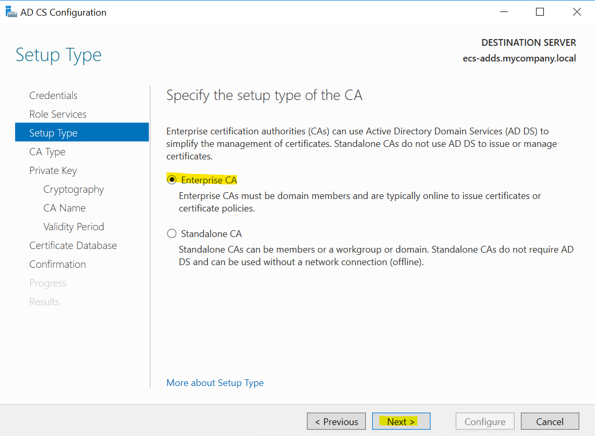

# Install Active Directory Certificate (CA) Service

Because the certificate service is required to install ADFS, you need to add the certificate service to your computer first. If you have a certificate service installed, skip this section.

1. Login to your ECS created to run the Active Directory.

2. Open server manager, click Add roles and features, in the Add Roles and Features Wizard that bounces out, Install Type select Role-based or Feature-Based Installation by default, and click Next.

3. In the following wizard pages click Next.

4. In the Server Role, confirm that Active Directory Certificate Service is checked, if it is not checked to indicate that it is not installed, check Active Directory, select by default in the pop-up window, and click Add Features to complete the installation of the Certificate Service.

5. In Role Services, select Certificate Authority by default and click Next.

6. In Confirm page, click Install.

7. When the installation is complete click *Configure Active Directory Certificate Services on the destination server*

8. Click Next in Credentials page in the AD CS Configuration window.

9. Select Certification Authority in Role Services and click Next.

10. In Setup type, select Enterprise CA, click Next.

11. Select Root CA in CA Type and click Next.

12. Select Create a new private key in Private Key page and click Next.

13. In the Encryptation page, select your encryptation level click Next.

14. In CA Name and Valid, use the default value, click Next.

15. Certificate Database are all selected by default, and click Next.

16. In Confirm, click Confirm to complete the certificate configuration.

17. When the configuration is successful, the configuration is prompted to be successful, as shown in the following image. Restart your computer for the configured certificate to take effect.

# Configure ADFS Certificate Template

1. Open Certificate Authority

2. Go to certificate template folder, right click and click manage

3. In the new window navigate to the *Web Server* certificate template, rigth click and click *duplicate template*

4. Make sure you do the same modification as the pictures below

5. Now create a new template certificate to issue. Right click on certificate template folder and click new --> *Certificate Template to Issue*

6. You now can see your newly created certificate template

## Finish ADCS instalation

