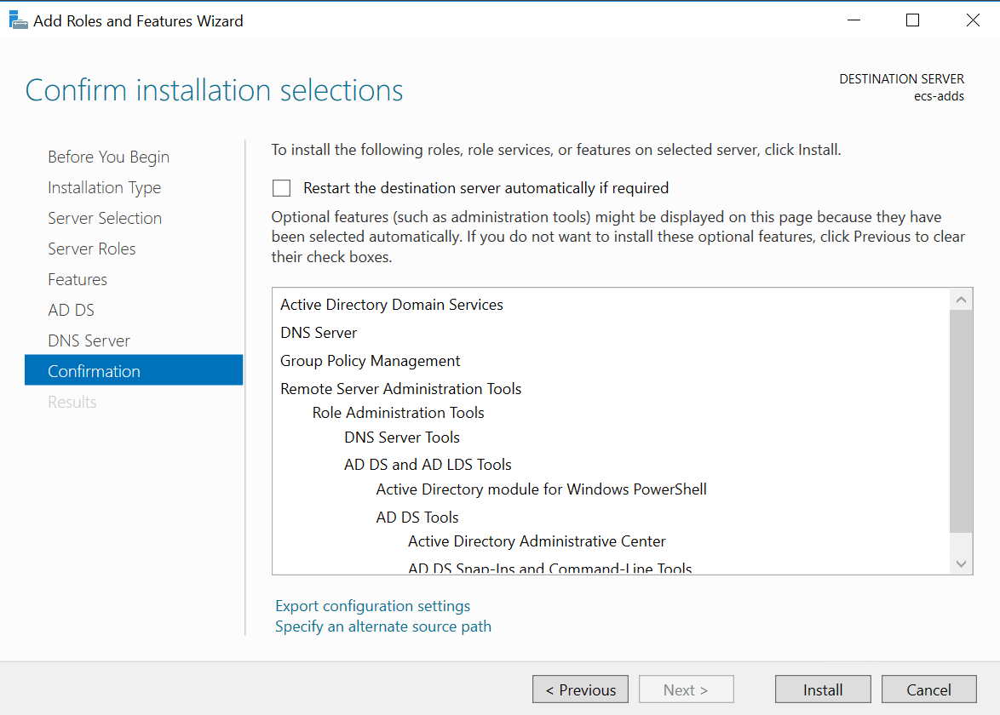

# Install Active Directory Domain Service

1. Login to your ECS created to run the Active Directory.

2. Open server manager, click Add roles and features, in the Add Roles and Features Wizard that bounces out, Install Type select Role-based or Feature-Based Installation by default, and click Next.

3. In the following wizard pages click Next.

   
4. Install ADDS & DNS Server Roles:
   * In the Server Role to see if the DNS server is installed, if not, check DNS Server, click Add Features by default in the pop-up window, and install DNS Server.
 

   * Then check Active Directory Domain Services in Server Roles, and click Add Features by default in the pop-up window to install active Directory Domain Services.

    
   * In the following wizard page click Next.  

5. In the following wizard pages click Next...

6. In the Confirm page click Install.

7. When the installation is complete, click the *Promte this server to the Domain Controller*.

## Promote Active Directory

1. In the pop-up window, Deploy Configuration select Add New Forest and fill in the root domain name, click Next. The new forest added in the example here is "mycompany.local".

2. Fill in the custom password in Domain Controller Selection and click Next.

3. Click Next in DNS Options.

4. In Other Options, click Next.

5. Leave the default in Path, and click Next.

6. In review Options, view and confirm the information, and click Next *Save Powershell script if you want to automate this taks for another environment*

7. Click Install in Option Condition Check.

8. When the installation is complete, the system will automatically restart so that the Active Directory installation configuration takes effect.

## Create users and groups.

1. Create two user groups, HWC-ADFSAdmin and HWC-ADFSGuest. Open the Active Directory Management Center with Management Tools.

2. Create two user, John and Daenerys.

3. Add users to the respective groups according to the requirements described in this [article](README.md).

## Finish Active Directory installation